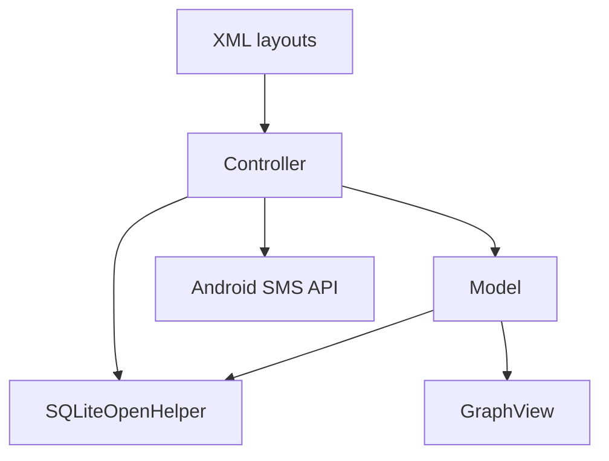

# Weight Tracker — Android and SQLite

Weight Tracker is an academic Android application for recording daily weigh-ins, comparing progress with a goal, and viewing a chronological trend. It was developed in Java for SNHU's CS 360: Mobile Architecture and Programming course.

> **Prototype safety notice:** Do not use this build for real credentials or health data. Passwords are currently stored as plaintext, phone numbers are initialized as empty strings with no collection workflow, and a database-version upgrade drops and recreates all tables.

## Implemented scope

| Area | Current behavior |
| --- | --- |
| Local accounts | Create an account and validate a username/password against SQLite |
| Goal tracking | Save a goal weight and calculate distance from the latest entry |
| Daily weigh-ins | Add a dated record or update the current day's entry |
| History | Display user-specific entries and delete individual records |
| Visualization | Plot stored weights chronologically with GraphView |
| SMS workflow | Save an opt-in preference, request Android's `SEND_SMS` permission, and attempt a message when a goal is reached |
| Persistence | Store users, goals, preferences, and weight records in three related SQLite tables |

The SMS preference and permission flow is present, but end-to-end notification behavior is not ready: account creation stores an empty phone number and the UI provides no way to enter one. The repository therefore does not demonstrate a validated working SMS notification feature.

## User flow

1. Create a local account with a goal weight, or sign in to an existing account.
2. Choose whether to enable the SMS preference.
3. Add or update today's weight.
4. Review the goal summary, line graph, and dated history.
5. Delete an individual history entry when needed.

The interface uses masked password input, numeric weight fields, inline warnings, and toast feedback. It refreshes the goal message, graph, and history after a data change so the three views remain aligned.

## Technical design

The code uses a small MVC-inspired separation. XML resources define the screens, `Controller` coordinates navigation and events, `Model` prepares application data, and `WeightTrackingDatabase` owns schema creation and CRUD operations.



### Stack

| Area | Committed configuration |
| --- | --- |
| Platform | Android; minimum API 24, compile/target API 37 |
| Language | Java source and target compatibility 11 |
| UI | Android XML, AppCompat, Material components, ConstraintLayout |
| Persistence | SQLite through `SQLiteOpenHelper` |
| Visualization | GraphView 4.2.2 |
| Build | Gradle Wrapper 9.5.0 and Android Gradle Plugin 9.3.1 |
| Build JVM criteria | JDK 25 in `gradle/gradle-daemon-jvm.properties` |
| Test dependencies | JUnit 4.13.2 and AndroidX JUnit/Espresso |

Java 11 is the app's source/bytecode target; it is not the runtime configured to execute this Gradle build. The committed daemon criteria request JDK 25. This pairing is consistent with the official compatibility tables: AGP 9.3 requires Gradle 9.5.0, and Gradle supports running on Java 25 beginning with Gradle 9.1. See the [Android Gradle plugin compatibility table](https://developer.android.com/build/releases/about-agp) and [Gradle Java compatibility matrix](https://docs.gradle.org/current/userguide/compatibility.html).

### Data model

- `user` stores a username, plaintext password, SMS preference, and phone-number field.
- `dailyWeight` stores dated weigh-ins associated with a username.
- `goalWeight` stores a user's goal.

Database access is centralized in the helper, and read queries use selection arguments. The current schema is suitable for studying local CRUD behavior, not for protecting sensitive data.

### Main components

| Path | Responsibility |
| --- | --- |
| [`Controller.java`](app/src/main/java/com/zybooks/michael_foster_weight_tracker/Controller.java) | Activity lifecycle, navigation, input handling, SMS permission, and goal checks |
| [`Model.java`](app/src/main/java/com/zybooks/michael_foster_weight_tracker/Model.java) | Account coordination, history rows, goal display, and graph preparation |
| [`WeightTrackingDatabase.java`](app/src/main/java/com/zybooks/michael_foster_weight_tracker/WeightTrackingDatabase.java) | Schema creation and account, goal, preference, and weigh-in CRUD operations |
| [layout resources](app/src/main/res/layout) | Login/registration, SMS preference, and tracking screens |

## Build and run

### Prerequisites

- Android Studio compatible with Android Gradle Plugin 9.3
- JDK 25 available for the committed Gradle daemon criteria
- Android SDK 37
- An emulator or device running Android 7.0 (API 24) or newer

Open the repository root in Android Studio, allow Gradle synchronization to complete, select an emulator/device, and run the `app` configuration. A command-line debug build can be requested with:

```powershell
.\gradlew.bat assembleDebug
```

On macOS or Linux:

```bash
./gradlew assembleDebug
```

These commands are derived from the committed build files. A fresh build was not executed during the documentation-only portfolio refresh, so current build success is not claimed here.

## Testing status

The repository contains the default example JUnit and Android instrumentation test scaffolding. It does **not** yet contain automated business tests for authentication, calculations, SQLite CRUD, migrations, permissions, or the main UI workflow.

Candidate commands after a successful Gradle synchronization are:

```powershell
.\gradlew.bat test
.\gradlew.bat connectedAndroidTest
```

`connectedAndroidTest` requires a configured emulator or connected device. The presence of test dependencies and example files should not be interpreted as comprehensive coverage.

## Known limitations and readiness work

Before this project should be featured as a polished mobile sample:

1. Hash credentials with an appropriate password-storage design rather than storing or comparing plaintext.
2. Add a validated phone-number workflow or remove the incomplete SMS path.
3. Replace destructive `onUpgrade` behavior with versioned, data-preserving migrations.
4. Add unit, database, migration, and Espresso tests around the core workflows.
5. Improve input validation, accessibility, responsive layouts, and error reporting.
6. Consider Room, ViewModel, and Navigation components if the prototype is expanded.

## Competencies demonstrated

- Java Android event handling and multi-screen navigation
- SQLite schema design and CRUD integration
- Coordinating persisted data with dynamic history and graph views
- Runtime permission flow and feature preference storage
- Translating mobile requirements into a usable vertical slice
- Reviewing a prototype honestly for security, migration, and test gaps

<details>
<summary>Development reflection</summary>

I developed the application incrementally, first identifying the screens, tables, and data flow and then connecting one complete feature at a time. That approach made it easier to isolate defects at the boundaries among the interface, controller logic, and database.

The strongest portion is the integration between SQLite and the tracking dashboard. A change to today's weight updates the persisted record, goal calculation, history rows, and graph. Converting stored dates into ordered graph points also allowed one data set to support newest-first history and chronological visualization.

The project reinforced that a compiling app is not the same as a production-ready one. Automated tests, secure credential handling, reliable migrations, validated notification data, accessibility, and failure handling all need explicit engineering work beyond the initial functional workflow.

</details>

## Academic context

Created by Michael Foster for CS 360: Mobile Architecture and Programming at Southern New Hampshire University. Use fictional account and health data when evaluating this academic prototype.
