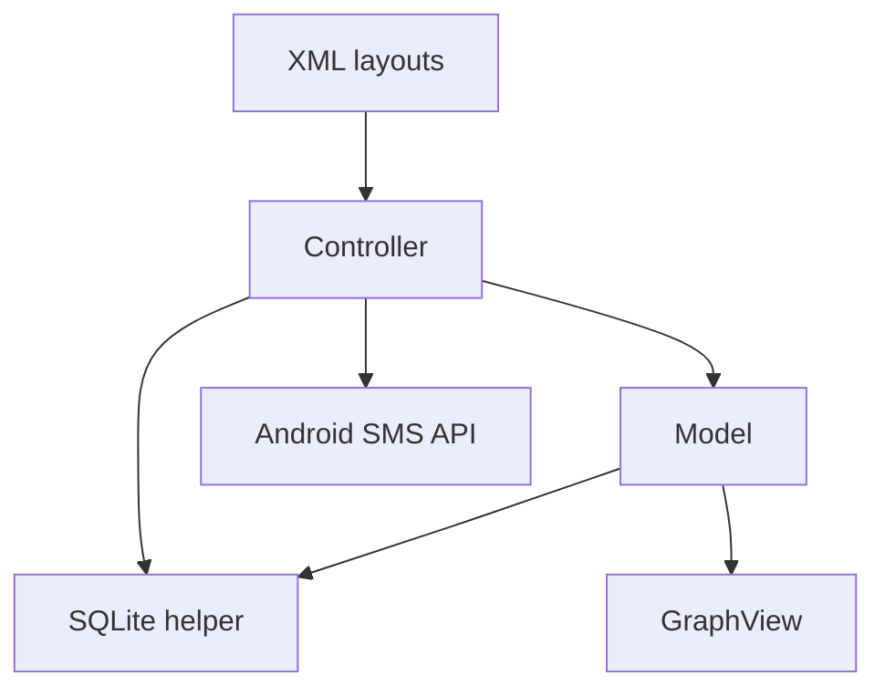

# Weight Tracker

Weight Tracker is a local-first Android application for recording daily weigh-ins, monitoring progress toward a goal weight, and reviewing changes over time. The project was developed in Java for SNHU's CS 360: Mobile Architecture and Programming course.

## Project Requirements at a Glance

| Requirement | Implementation |
| --- | --- |
| User accounts | Create a local account and log in with saved credentials |
| Goal tracking | Set a goal weight during registration and view the remaining pounds on the dashboard |
| Daily weigh-ins | Add today's weight or update the existing entry for the current date |
| Weight history | Display saved entries by date and allow individual entries to be deleted |
| Progress visualization | Plot recorded weights chronologically in a line graph |
| SMS option | Save an opt-in preference, request Android's SMS permission only when needed, and evaluate goal completion after a weigh-in |
| Local persistence | Store account, goal, preference, and weigh-in data in a relational SQLite database |

## Overview

The app addresses a simple user need: keeping a private, easy-to-read record of weight progress without requiring a cloud account or a feature-heavy fitness platform. After creating an account, a user can enter one weigh-in per day, revise that day's value, review or delete previous entries, and see progress in both a goal summary and a graph.

The interface keeps the main task—recording today's weight—at the top of the tracking screen. Supporting information is progressively disclosed through a compact progress message, a visual trend line, and a scrollable history. Clear input types, familiar controls, consistent green-and-white styling, and immediate feedback help users understand what to do on each screen.

## Key Features

- Local account creation and credential validation
- Goal-weight capture during registration
- Daily weight create, read, update, and delete operations
- Automatic add-or-update behavior for the current day's weigh-in
- User-specific, scrollable weight history
- Chronologically sorted weight-progress graph
- Goal-distance calculation based on the latest daily entry
- Optional SMS preference with runtime permission handling
- Inline warnings and toast feedback for invalid or incomplete actions
- Custom Back behavior between the registration and login views

## User Experience

| Screen | Purpose | User-centered design choices |
| --- | --- | --- |
| Login and registration | Authenticates an existing user or creates a new account and goal | Uses a familiar form pattern, password input masking, numeric goal input, clear primary actions, and predictable Back navigation |
| SMS preference | Lets a new user opt in to or decline goal notifications | Explains the feature before requesting permission, displays a warning when SMS is disabled, and asks for Android permission only after opt-in |
| Weight dashboard | Supports daily entry, goal monitoring, graphing, history review, updates, and deletion | Places the daily action first, combines visual and numeric progress, keeps history scrollable, and refreshes all displayed data after a change |

## Technical Design

The project uses a small MVC-inspired separation of concerns. XML resources define the views, `Controller` handles screen transitions and user events, `Model` prepares data for display, and `WeightTrackingDatabase` owns SQLite schema creation and CRUD operations.



### Technology Stack

| Area | Technology |
| --- | --- |
| Platform | Android 7.0+ (minimum API 24) |
| Language | Java 11 |
| UI | Android XML layouts, AppCompat, ConstraintLayout, and standard Android widgets |
| Persistence | SQLite through `SQLiteOpenHelper` |
| Visualization | GraphView 4.2.2 |
| Build system | Gradle 9.5 with Android Gradle Plugin 9.3.1 |
| Testing libraries | JUnit 4 and AndroidX Test/Espresso |

### Data Model

The local database contains three related tables:

- `user` stores the username, local credential, SMS preference, and phone-number field.
- `dailyWeight` stores a user's dated weigh-ins and uses a foreign key back to `user`.
- `goalWeight` stores one goal per user and also uses a foreign key back to `user`.

Parameterized queries are used when reading records, and database operations are kept inside the SQLite helper rather than spread throughout the UI code.

### Main Components

| Path | Responsibility |
| --- | --- |
| `app/src/main/java/.../Controller.java` | Activity lifecycle, navigation, input handling, runtime SMS permission, and goal checks |
| `app/src/main/java/.../Model.java` | Account coordination, dynamic history rows, goal display, and graph preparation |
| `app/src/main/java/.../WeightTrackingDatabase.java` | Database schema and user, goal, preference, and weigh-in CRUD operations |
| `app/src/main/res/layout/activity_login.xml` | Login and account-creation interface |
| `app/src/main/res/layout/activity_sms_notification.xml` | SMS preference interface |
| `app/src/main/res/layout/activity_weight_tracking.xml` | Daily entry, progress graph, and weight-history interface |

## Getting Started

### Prerequisites

- A current version of Android Studio
- JDK 11 or a compatible Android Studio-managed JDK
- Android SDK 37 for compilation
- An emulator or Android device running Android 7.0 (API 24) or newer

### Run the App

1. Clone the repository:

   ```bash
   git clone https://github.com/mf0zz13-SNHU-School-Work/CS-360.git
   ```

2. Open the cloned `CS-360` directory in Android Studio.
3. Allow Gradle to synchronize and download the GraphView dependency.
4. Select an emulator or connected Android device.
5. Run the `app` configuration.

The project can also be built from the command line:

```bash
bash gradlew assembleDebug
```

On Windows, use `gradlew.bat assembleDebug`.

## Testing

Development testing was performed incrementally in the Android emulator after each feature was connected. The main end-to-end checks covered account creation, valid and invalid login attempts, local persistence, first-time and same-day weight entry, history deletion, progress recalculation, graph refresh, and both outcomes of the SMS permission request.

Testing each feature in the context of the full workflow was important because many defects appeared at the boundaries between the interface, controller logic, and database—not within a single method. It revealed the need to refresh the history, goal message, and graph together after a database change; sort date-based data before graphing it; validate numeric input; and preserve the user's chosen notification state through Android's asynchronous permission callback.

The repository currently includes basic JUnit and Android instrumentation test scaffolding. These checks can be run with:

```bash
bash gradlew test
bash gradlew connectedAndroidTest
```

Expanding the automated suite to cover database CRUD behavior, model calculations, and Espresso UI flows is a planned improvement.

## Current Scope and Future Improvements

This repository is an academic prototype rather than a production health application. The next improvements would be to:

- Hash and securely store credentials instead of treating the local database as a production authentication system.
- Add a validated phone-number field before attempting to send a goal-completion SMS.
- Add comprehensive unit, database, and Espresso UI tests.
- Improve accessibility, responsive layout behavior, and input validation.
- Migrate to modern Android architecture components such as Room, ViewModel, and the Navigation component.
- Support editing goal weight and notification preferences after registration.

## Development Reflection

### Requirements and User Needs

The goal was to create a functional Android weight tracker with local account creation and login, persistent daily weight records, a goal weight, editable history, a progress graph, and an optional SMS notification path. The app was designed for users who want a straightforward way to record their weight, understand whether they are moving toward a goal, and review progress without navigating a complicated fitness application.

### Screens, Features, and User-Centered UI

The app required a login and account-creation experience, an SMS preference screen, and a weight-tracking dashboard. I kept users in mind by relying on familiar form controls, limiting each screen to a clear purpose, using consistent colors and spacing, and keeping the most common action at the top of the dashboard. Immediate warnings and toast messages help users recover from invalid input, while the goal summary, graph, and scrollable history present the same information at different levels of detail. These designs were successful because users can complete the primary workflow in only a few steps and can see the result of each action immediately.

### Coding Approach

I began by identifying the required screens, data tables, and movement of information between them. I then implemented the app incrementally, connecting one complete feature at a time and separating layout, interaction, display, and persistence responsibilities across the XML views, controller, model, and database helper. Working in small, testable steps made it easier to isolate defects and avoid changing multiple parts of the app at once. I can apply the same strategy to future projects by planning the interface and data flow before coding, creating a working vertical slice early, and extending it through focused iterations.

### Functional Testing

I tested the app repeatedly in the Android emulator as features were added, including successful and unsuccessful authentication, account creation, data persistence, adding and updating today's weight, deleting a history entry, refreshing the graph and goal message, and granting or denying SMS permission. This process is important because code can compile while the complete user workflow still fails. Testing revealed integration issues involving screen state, input validation, permission timing, date ordering, and keeping multiple UI components synchronized with the database.

### Innovation and Problem Solving

One challenge was keeping the weight-history rows, goal message, input field, and graph synchronized after every insert, update, or deletion. I overcame this by generating the history rows from database results, attaching an action to each row, and refreshing every dependent view after a change. I also converted the stored date strings into sortable graph points so entries could be displayed chronologically even though the history list shows the newest record first. This allowed the same underlying data to support two different user-centered presentations.

### Strongest Component

I was particularly successful in integrating the SQLite data layer with the tracking dashboard. The database uses related tables and focused CRUD methods to keep each user's account, goal, preference, and dated weigh-ins organized. Connecting those results to dynamically created history rows, same-day update behavior, goal calculations, and a line graph demonstrated my skills with Java, SQL, Android event handling, data persistence, and coordinating application state across multiple UI elements.

## Academic Context

Developed by Michael Foster as a portfolio artifact for **CS 360: Mobile Architecture and Programming** at Southern New Hampshire University.
